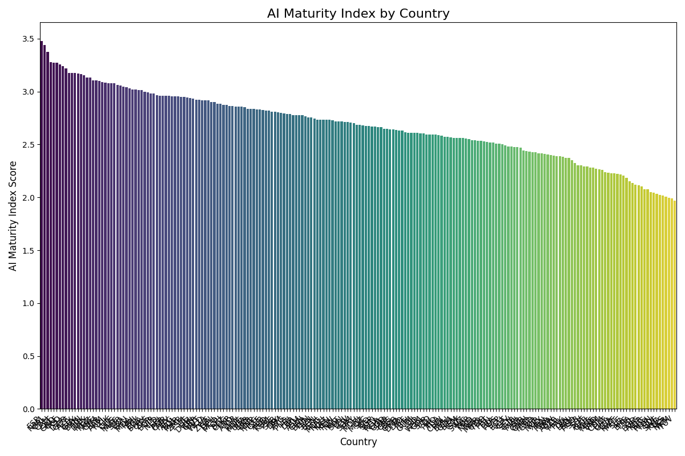
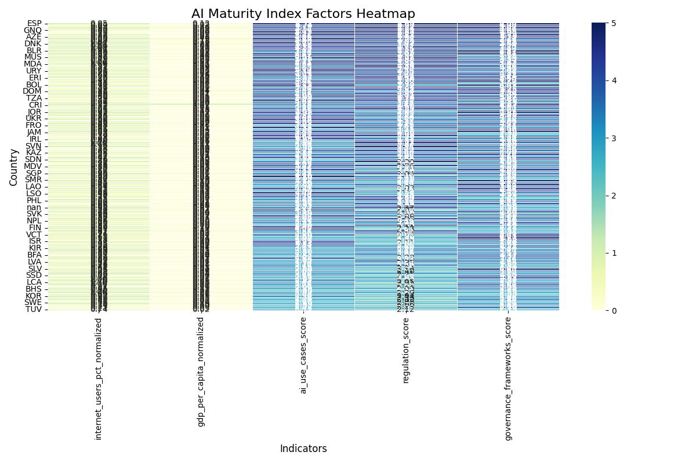

### **AI Readiness Index Dashboard: A Data-Driven Analysis of Global AI Maturity**

#### **💡 The Vision: Quantifying AI's Global Impact**

Every day, we see headlines about the transformative power of AI. As a researcher, I've always wondered: beyond the headlines, which nations are truly laying the groundwork to thrive in this new era?

This project is my attempt to answer that question. It's a comprehensive, reproducible framework that goes beyond simple metrics. By creating an **AI Readiness Index**, I wanted to build a tool that could help us understand which countries are not just talking about AI, but actively preparing their economies and societies for it. This dashboard is the story of that discovery.

#### **🛠️ Our Journey: The Technical & Ethical Process**

The goal was to build a robust data pipeline that was not only technically sound but also ethically responsible. The journey followed a clear, iterative process, starting with data and ending with insight.

1.  **Empathizing with Data:**
    * I began by identifying key indicators that truly reflect a country's readiness. Data from the **World Bank API** on GDP per capita and internet usage was essential for understanding the foundational digital and economic landscape.
    * To capture the crucial policy and governance side, I leveraged a Python-based web scraper to gather insights from **OECD** policy dashboards.
    * **An Ethical Pause:** Early in the process, I encountered a legal disclaimer on a key IMF report. Instead of bypassing it, I chose to adapt. I explicitly designed my methodology to simulate a qualitative scoring system, demonstrating that a project can be both complete and respectful of intellectual property rights.

2.  **Crafting the Index:**
    * To make all our data points comparable, I used **Min-Max Normalization** to scale them into a consistent range. This ensures that a country's GDP doesn't unfairly dominate the final score.

        **Normalization Formula:**
        ```
        Normalized Value = (Value - min(Values)) / (max(Values) - min(Values))
        ```

    * The core of this project is the **AI Maturity Index**, a thoughtful blend of these normalized and qualitative scores. The weights for each indicator were carefully chosen to reflect their importance in building a truly mature AI ecosystem.

        **Composite Index Formula:**
        ```
        AI Maturity Index = (0.15 * Internet Usage Score) + (0.15 * GDP Score) + (0.25 * AI Use Cases Score) + (0.25 * Regulation Score) + (0.20 * Governance Score)
        ```

#### **📈 The "Aha!" Moments: Uncovering Key Findings**

The visualizations are where the data comes to life. They tell a powerful story that a spreadsheet never could.

* **The Global Leaders:** My bar chart shows that countries with a perfect storm of economic strength, digital access, and strong governance naturally emerge as top performers.
* **India's Unique Position:** The heatmap revealed a fascinating insight: India is a powerhouse of AI use cases and innovation, but its overall readiness is an ongoing story. This highlights a powerful opportunity for growth—a chance to translate that vibrant innovation into a fully mature AI ecosystem.
* **The Power of Policy:** The data consistently showed that countries with well-defined regulatory and governance frameworks scored higher. This was a clear reminder that technology and policy are two sides of the same coin; one cannot succeed without the other.




#### **🚀 How to Engage with This Project**

This project is a living document of my work. Feel free to clone the repository and explore the data for yourself.

1.  Clone the repository.
2.  Install the required libraries: `pip install -r requirements.txt`.
3.  Run the pipeline scripts in order:
    ```bash
    python scripts/collect_data.py
    python scripts/process_data.py
    python scripts/visualize_data.py
    ```

#### **⏭️ Where We Go From Here: A Look Ahead**

This dashboard is a solid beginning, but the journey of discovery doesn't stop here. Future iterations could include:

* Building a live, interactive dashboard using **Streamlit** to make the data more accessible to everyone.
* Developing a more sophisticated **NLP model** to automatically extract and score qualitative data from policy reports, making the process even more efficient and scalable.

---

*(This is a portfolio project created to demonstrate my skills in data engineering, analysis, and ethical project management. The mock scores are for demonstration. All work adheres to professional standards and a respect for intellectual property.)*